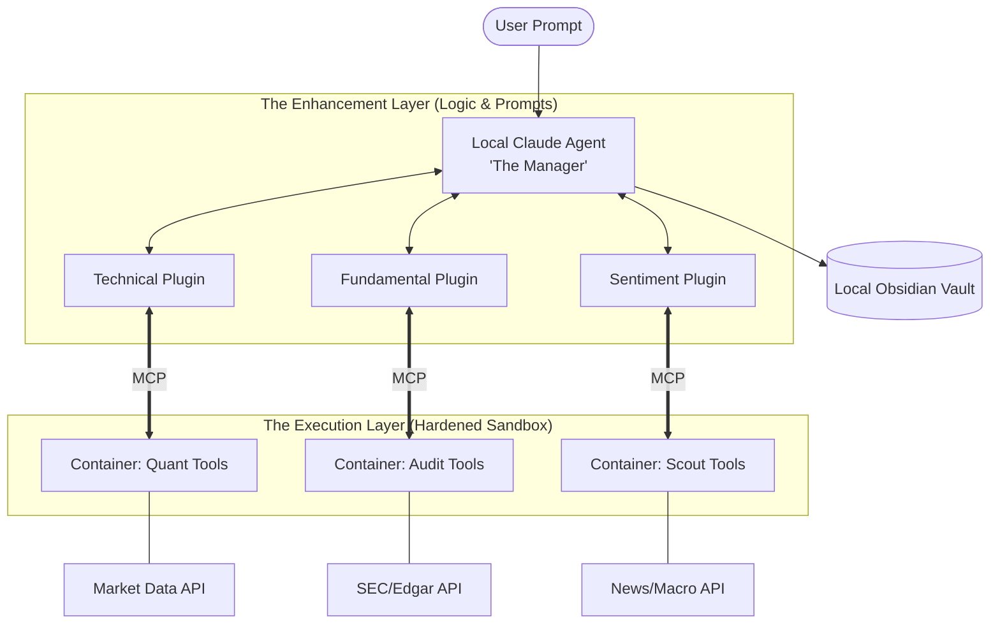

## Multi-Agent Equity Analysis Framework

This architecture leverages the **Model Context Protocol (MCP)** to transform Claude from a chatbot into an orchestration layer for financial analysis. By using a "team" of agents, we can mitigate the inherent biases of any single investment philosophy.

## Decisions and non-goals

### Decisions (locked for this spec)

* **Orchestration:** **LangGraph** — explicit graph state and edges between **Scout → Auditor → Analyst → Manager** (Aggregator) nodes.
* **Inter-node handoff:** **JSON** is the canonical machine-readable payload between nodes. Each receiving step validates against a **Pydantic v2** model (per edge / per node output type) before downstream logic runs; invalid payloads fail fast or trigger a bounded repair/retry policy (to be specified in implementation).
* **Human-facing exports:** Optional markdown tables or memos in **Obsidian** are **derived** from validated JSON, not the source of truth for graph state.
* **Unified Confidence Score (0–100):** Treated as a **draft label** until a follow-on spec defines **inputs**, **per-plugin subscores**, **aggregation rule**, and **human override**; vault tables may omit or gray out the column until then.

### Non-goals (v1)

* Choosing between **CrewAI** and LangGraph (LangGraph only).
* Using markdown/CSV tables as the **only** handoff between LangGraph nodes (tables are views, not canonical state).
* Live trading, execution algos, or broker integration.

### Kill criteria (fail fast early; relax via config over time)

**Philosophy:** First iterations should **trip on anything suspicious** across **technical**, **research-quality**, and **operational** safety—then **fix the root cause**. Numeric limits, enable/disable flags, and “warn vs abort” severity should live in **versioned configuration** so the same LangGraph can start strict and gradually loosen thresholds without rewriting code.

**Initial tripwires (representative set; exact defaults live in implementation config):**

1. **Technical / graph integrity**
   * **Pydantic handoff failure** after a **bounded** parse-or-repair attempt → **abort** the run with a structured error (no partial downstream writes).
   * **Scout empty universe** or **Auditor zero pass-through** when the user did not explicitly request a dry-run / stress mode → **abort** (or allow only a **blocking** Manager artifact that explains why—no “phantom” picks).
   * **Data quality:** missing required fields, duplicate dates, or gap fraction above a configured ceiling for any in-scope symbol → **abort** (or drop symbol with policy—**must be explicit in config**, default strict).

2. **Operational / cost (single `run_budget` config)**
   * One configuration object **`run_budget`** holds **both** limits; the run **aborts** when **either** bound is exceeded: **elapsed wall-clock** over `run_budget.max_seconds` **or** **estimated cumulative spend** over `run_budget.max_spend_usd` (names illustrative).
   * **`max_spend_usd` meaning:** a **single rolling total** of **tool/API cash** (billed or estimated per provider) **plus** **estimated LLM cost** from usage (e.g. token counts × a **configurable per-model price table**). Document that early versions may **underestimate**; treat the number as a **tripwire**, not accounting-grade truth.
   * **Until LLM $ estimates are trustworthy:** the same `run_budget` object may also define **optional hard caps** (e.g. `max_llm_tokens`, `max_graph_steps`) that **abort earlier**; relax or remove these once spend metering is validated against real invoices.
   * Operators tune **one place** (`run_budget`); splitting into more granular controls is optional later if metrics justify it.

3. **Research-quality gates**
   * Directional output (**Buy / Hold / Avoid** or equivalent) without required **evidence slots** (e.g. tool run IDs, filing URLs, transcript IDs—exact list TBD) → **block vault write**; emit a **blocking** JSON error for the user.
   * **Hard cross-plugin conflict** (e.g. fundamental disqualifier vs technical “go”) with no defined override rule → **no Unified Confidence Score**; emit **`insufficient_consensus`** (or omit score column) until rules exist.

4. **Security / policy**
   * Any observation of **egress outside role allowlists** for an MCP server (e.g. Fundamental server not limited to SEC/EDGAR as intended) → **abort** and **block** promotion to higher-trust environments until fixed.

**Evolution:** Move checks from **hard kill** → **warn + continue** only after metrics show stable near-miss rates; keep kill switches for irreversible harms (secrets, egress violations, silent empty universes).

---

### 1. Overview of the Three Plugin Families

Financial MCP servers generally fall into three distinct architectural and logical "families." Each family provides the LLM with a different "sensory organ" for the market.

| Family | Primary Data Source | Core Objective | Typical Tools |
| --- | --- | --- | --- |
| **Technical / Momentum** | Exchange Price Feeds | Identifying price patterns, trend strength, and entry/exit timing. | `yfinance-mcp`, `alpaca-mcp`, `tradingview-mcp` |
| **Fundamental / Value** | SEC Filings, Balance Sheets | Determining "intrinsic value" and financial health. | `sec-mcp`, `edgar-mcp`, `capital-iq-mcp` |
| **Sentiment / Macro** | News Aggregators, Social, Fed Data | Gauging market "mood" and identifying qualitative tailwinds. | `newsapi-mcp`, `lseg-mcp`, `browser-use` |

---

### 2. Comparative Analysis: Pros & Cons

#### **Technical / Momentum**

* **Pros:** Highly objective; excellent for short-term timing; easy to automate with mathematical triggers (RSI, Moving Averages).
* **Cons:** Prone to "whipsaws" (false signals); ignores why a stock is moving; high competition from HFT (High-Frequency Trading) bots.

#### **Fundamental / Value**

* **Pros:** High margin of safety; aligns with long-term wealth building (REITs/BDCs); less affected by daily market volatility.
* **Cons:** Data is "lagging" (quarterly reports); a "cheap" stock can stay cheap forever (value traps); requires deep accounting knowledge to vet properly.

#### **Sentiment / Macro**

* **Pros:** Captures "the why" behind a move; identifies emerging tech trends (like Agentic AI) before they hit the balance sheet.
* **Cons:** High noise-to-signal ratio; subjective; sentiment can flip instantly based on a single tweet or news headline.

---

### 3. Implementation Plan: The "Triton" Agent Team

Use **LangGraph** to manage graph state and handoffs between specialized nodes (see **Decisions and non-goals** above).

Phases are ordered **0 → 1 → 2 → 3**: **Phase 0** proves the **orchestration and safety rails** with minimal external surface; **Phase 1** adds the hardened execution environment (Docker, egress, vault sync).

#### **Phase 0: Graph, contracts, kills, and one real integration (POC)**

**Goal:** Ship a runnable **end-to-end LangGraph** (Scout → Auditor → Analyst → Manager) with **JSON handoffs**, **Pydantic v2 validation** on each edge, **`run_budget`** enforcement (at least **`max_seconds`** and a **best-effort spend accumulator**—see kill criteria), and **representative kill trips** under test—**before** committing to Phase 1’s full Docker/MCP/Obsidian hardening.

**In scope**

* **Graph:** all four node types exist and run in order; state is explicit and serializable where useful for tests.
* **Contracts:** one **Pydantic model per outbound payload type** per edge; invalid JSON → **fail fast** after a **bounded** parse/repair attempt (policy spelled out in code/docs; default: **one** repair retry or none—implementation choice, must be documented).
* **Stubs:** any node not yet backed by real data/tools returns **deterministic fixture JSON** that still validates against the same schemas (so downstream logic is real).
* **Kills:** wire at least **Pydantic failure** and **run_budget** (`max_seconds` + rolling **`max_spend_usd`** estimate); other kills from the list may start as **tests-only** or **warn**, then promote to **abort** as confidence grows.

**One real integration (required for Phase 0 exit — locked for this POC)**

Exactly **one** of the following is implemented with **real** credentials, network, or filesystem (the others remain **stubbed** until a later phase). **This repository locks Phase 0 to:**

* **LLM (locked):** at least one graph step calls a **real** model API; **token usage** feeds the **`max_spend_usd`** estimate per the **run_budget** section (best-effort until pricing tables are validated).

**Deferred to later phases (stub in Phase 0)**

1. **MCP tool:** host invokes real MCP tools inside/outside Docker (Phase 1+ for hardened servers).
2. **Obsidian:** derived vault writes and git-hook sync (optional file write can be added as a separate small milestone if needed).

Record any provider-specific env vars and pricing assumptions in implementation docs or `README` (never commit secrets).

**Out of scope for Phase 0**

* Full **Phase 1** container fleet, production-style **egress allowlists**, or **git-hook** vault sync (unless **Obsidian** is the single chosen integration—in that case only **file write** is in scope, not full sync automation).
* Live trading, broker connectivity, or production deployment.

**Exit criteria (Phase 0 done when)**

* **Implementation:** Python package `src/stock_picker/poc1/`, CLI `uv run stock-picker poc1 run --prompt "…"`.
* A single CLI or `uv run` entrypoint runs the **full graph** once on a sample prompt.
* **Invalid handoff JSON** aborts or errors per policy without corrupting downstream state.
* **`run_budget`** can **trip** under a controlled test (time or spend).
* The **one chosen real integration** works end-to-end (credentials/path documented in env or local config, not committed to git).

#### **Phase 1: Environment & Hardening**

* **Containerization:** Deploy each MCP server in a separate **Docker** container.
* **Egress Filtering:** Configure your network to ensure the "Fundamental Agent" can only talk to SEC.gov/EDGAR, preventing data leakage.
* **Obsidian Sync:** Set up a local Git hook to push agent outputs directly into your Obsidian vault as daily markdown notes.

#### **Phase 2: The Agent Workflow (The "Consensus" Model)**

1. **The Scout (Technical):** Scans the top 500 tickers.
* *Trigger:* "Find all tickers where the 50-day MA has crossed the 200-day MA and RSI is < 60."

2. **The Auditor (Fundamental):** Receives the Scout's list.
* *Filter:* "Of these tickers, keep only those with a Debt/Equity < 1.0 and a Dividend Yield > 3%."

3. **The Analyst (Sentiment):** Performs a deep search on the remaining candidates.
* *Search:* "Analyze the last 3 transcript calls for [Ticker]. Are there mentions of supply chain risks or management changes?"

4. **The Manager (Aggregator):** Compiles the final report.
* *Output:* A Markdown table in your Obsidian vault; may include a **draft** "Unified Confidence Score" (0–100) once its schema is defined (see **Decisions and non-goals**).

#### **Phase 3: Backtesting & Refinement**

* Integrate the agent's "High Confidence" picks into your **Monte Carlo simulation** software.
* Compare the agent's picks against historical regime changes to see how the "Consensus" model would have performed during the 2022 rate hikes or the 2024 AI surge.

---

## Spec Summary: Hardened Agentic Stock Selection Framework

### 1. Architectural Overview

The system follows a **Hub-and-Spoke** model where a central LLM (The Aggregator) orchestrates specialized "skill modules" (Plugins) that execute via isolated environments (Dockerized MCP Servers).

**The Architecture Diagram:**

---

### 2. Refinement of Understanding

To improve the technical precision of your spec, note these three distinctions:

* **Plugin vs. Tool:** A **Plugin** is the "Expertise" (the specialized prompts, financial logic, and reasoning patterns). A **Tool** is the "Function" (the actual Python/Node code inside the container that fetches data). The Plugin tells the Agent *which* tool to use and *how* to interpret the result.
* **The MCP Role:** MCP is not the plugin itself; it is the **transport layer** between the host agent and MCP servers (often compared to a universal connector). **Security is not automatic:** isolation depends on **how** you run servers (no host bind mounts for secrets, minimal filesystem access, secrets injected per session, least-privilege egress). **Threats to design for (v1):** (1) **Tool output injection** — malicious or mistaken tool payloads influencing the host agent; (2) **Secret sprawl** — API keys in container env or logs; (3) **Over-broad egress or RPC exposure** — a compromised server exfiltrating beyond its intended domain (e.g. not only SEC).
* **Statelessness:** The containers should be **stateless and ephemeral**. They don't "remember" previous trades. The "Memory" of the investment strategy lives in your **Obsidian Vault**, which the Aggregator reads at the start of a session.

---

### 3. Execution Example: The "Triton" Consensus

**User Query:** *"Analyze SOFI for a high-yield retirement position."*

1. **The Aggregator** triggers the **Technical Plugin**, which calls a tool in **Container 1** to check the 200-day Moving Average.
* *Result: "Bullish momentum detected."*

2. **The Aggregator** then triggers the **Fundamental Plugin**, which calls **Container 2** to pull SOFI’s latest 10-K from SEC Edgar.
* *Result: "Meets Debt-to-Equity requirements, but P/E is high for the sector."*

3. **The Aggregator** triggers the **Sentiment Plugin**, which calls **Container 3** to scan Bloomberg and Reddit.
* *Result: "High retail interest, but 2 analyst downgrades in the last 48 hours."*

4. **Final Output:** The Aggregator synthesizes these conflicting signals and writes a "Hold" recommendation to your **Obsidian Vault**, citing the high P/E and recent downgrades as risks to the retirement timeline.

---

**Next artifacts:** Pydantic model list per graph edge (field names and types) for **Phase 0**; LLM provider env + **per-model price table** for **`run_budget`**. **Phase 1:** minimal `docker-compose` sketch for three isolated MCP server networks aligned with egress policy.
